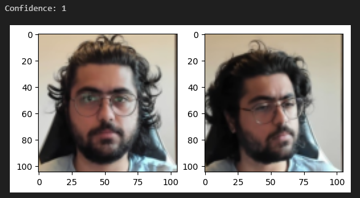
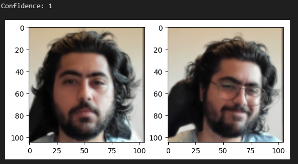
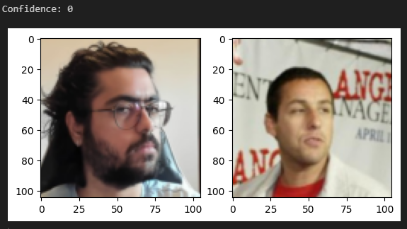
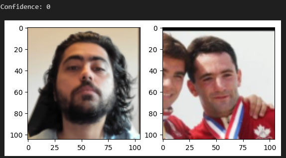

# Siamese Neural Network for Image Similarity

This project demonstrates the implementation of a Siamese Neural Network (SNN) using PyTorch. The model is designed to learn image similarity by comparing pairs of images and determining whether they belong to the same class or not. This technique is commonly used for tasks such as face recognition, where the model must decide if two images depict the same person.

## Project Structure

The project consists of the following main components:

1. **Data Preparation:**
   - The dataset used is the [Labeled Faces in the Wild (LFW)](http://vis-www.cs.umass.edu/lfw/) dataset.
   - Along with the LFW dataset, OpenCV is used to collect anchors and positives.
   - The dataset is divided into three categories: positive (same person), negative (different persons), and anchor (reference image).
   - A structure of directories is set up to store these images in separate folders (`data/positive`, `data/negative`, `data/anchor`).
   - Utility functions are provided to automatically populate these directories from the LFW dataset.

2. **Data Loading:**
   - Custom `ImageDataset` class inherits from `torch.utils.data.Dataset` to handle loading and preprocessing of image pairs.
   - The dataset is split into training and testing sets, and data loaders are created for efficient batching and shuffling.

3. **Model Architecture:**
   - The Siamese network architecture is defined in the `Embdedding` class.
   - It consists of several convolutional layers followed by fully connected layers that transform input images into a fixed-size embedding vector.
   - The embeddings are compared using L1 distance metric to determine the similarity between image pairs.

4. **Training:**
   - The training loop iterates through batches of image pairs, computes the loss using Binary Cross Entropy loss, and updates the model weights.
   - Training progress is logged using TensorBoard, allowing for real-time monitoring of loss and other metrics.

5. **Evaluation:**
   - The model is evaluated on a separate test set to measure its performance in recognizing similar and dissimilar pairs.
   - The results are visualized using matplotlib, displaying both the anchor and comparison images along with the predicted similarity score.

## Usage

### Clone the Repository

First, clone the repository to your local machine using the following command:

```bash
git clone https://github.com/DJPillu/Siamese-Network.git
```

Navigate into the project directory:

```bash
cd siamese-network
```

### Install Dependencies

Ensure you have Python 3.x and the required packages installed:

```bash
pip install -r requirements.txt
```

### Prepare the Dataset

1. Download the LFW dataset and extract it to the root directory of the project.
2. Run the data preparation cells in the Jupyter notebook to collect your own samples and organize the dataset into positive, negative, and anchor categories.

### Train the Model

1. Open the Jupyter notebook (`setup.ipynb`).
2. Run the training cells to start training the Siamese network.
3. Adjust hyperparameters such as batch size, learning rate, and number of epochs as needed.

### Evaluate the Model

After training, evaluate the model on the test set and visualize the results using the provided code cells.

## Model Results

The Siamese Neural Network was trained and tested on various image pairs to determine their similarity. Below are examples of the model's output:

### Similar Image Pairs (Confidence: 1)

These pairs were identified by the model as representing the same individual:




### Dissimilar Image Pairs (Confidence: 0)

These pairs were identified by the model as representing different individuals:




## Further Steps

- **Further Training:** Model is able to discern my own face from others, however, it is important to create more comprehensive datasets with positives and anchors for various other people to generalize the Model's learning and so it is able to create reliable embeddings for anybody.
- **Data Augmentation:** Apply various data augmentation techniques such as rotations, translations, and color adjustments to make the model more robust to variations.
- **Integrate with other models:** Create an application that uses YOLO model to process and obtain bounding boxes, which are then ran through the Siamese Network to tally against a list of known persons' embeddings to recognize and authenticate.
- **Application Deployment:** Deploy the trained model as a web service using Flask or FastAPI, allowing for real-time image similarity detection through an API.

## References

- [Siamese Neural Networks for One-shot Image Recognition](https://www.cs.cmu.edu/~rsalakhu/papers/oneshot1.pdf)
- [Labeled Faces in the Wild](http://vis-www.cs.umass.edu/lfw/)

## License

This project is licensed under the MIT License.
